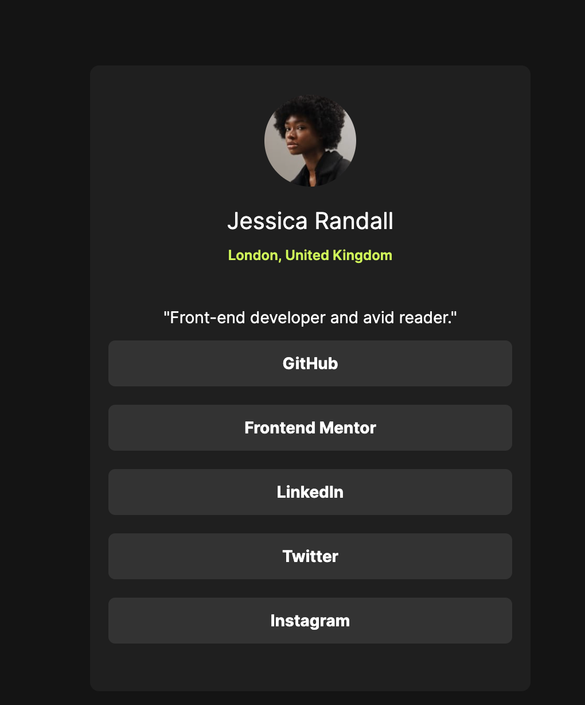

# Frontend Mentor - Social links profile solution

This is a solution to the [Social links profile challenge on Frontend Mentor](https://www.frontendmentor.io/challenges/social-links-profile-UG32l9m6dQ). Frontend Mentor challenges help you improve your coding skills by building realistic projects.

## Table of contents

- [Overview](#overview)
  - [The challenge](#the-challenge)
  - [Screenshot](#screenshot)
  - [Links](#links)
- [My process](#my-process)
  - [Built with](#built-with)
  - [What I learned](#what-i-learned)
  - [Continued development](#continued-development)
  - [Useful resources](#useful-resources)
- [Author](#author)
- [Acknowledgments](#acknowledgments)

## Overview

### The challenge

Users should be able to:

- See hover and focus states for all interactive elements on the page

### Screenshot



### Links

- Solution URL: [Add solution URL here](https://your-solution-url.com](https://www.frontendmentor.io/solutions/frontend-mentor-social-links-profile-solution-zigMIJQz0G)
- Live Site URL: [Add live site URL here](https://your-live-site-url.com](https://frontend-mentor-social-links-profile-solution-ten.vercel.app/)

## My process

### Built with

- Semantic HTML5 markup
- Mobile-first workflow
- Tailwind CSS

### What I learned

While working on this project, I reinforced my understanding of:

- Using Tailwind CSS for styling, including responsive design with flexbox utilities.
- Integrating custom fonts, such as the "Inter" font family, and managing font sizes and colors.
- Creating a responsive layout using Tailwind's utility classes.

```html
<!-- Example of Tailwind CSS classes -->
<div class="bg-darkgray flex justify-center items-center h-screen font-inter">
  <article
    class="mx-auto flex flex-col bg-darkgray justify-evenly items-center w-96 h-4/5 p-4 rounded-lg "
  >
    <!-- ... other HTML content ... -->
  </article>
</div>
```

## Continued Development

In future projects, I plan to continue focusing on:

- Enhancing my knowledge of Tailwind CSS and exploring more advanced features.
- Exploring additional ways to improve the accessibility and responsiveness of web applications.
- Incorporating JavaScript for interactive features and functionality.

## Useful Resources

- [Tailwind CSS Documentation](https://tailwindcss.com/docs): The official documentation for Tailwind CSS provided valuable guidance on class usage and customization.
- [Google Fonts](https://fonts.google.com/): A source for adding custom fonts to the project, enhancing the visual appeal of the profile.

## Author

- Website - [Jonatan](https://xyonax.github.io/PortfolioV1/)
- Frontend Mentor - [@XyonaX](https://www.frontendmentor.io/profile/XyonaX)
- Twitter - [@JonatanEze\_](https://www.twitter.com/JonatanEze_)

## Acknowledgments

I want to express my gratitude to Frontend Mentor for providing challenging projects that help me improve my skills. Additionally, thanks to the Tailwind CSS community for their excellent documentation and resources.
